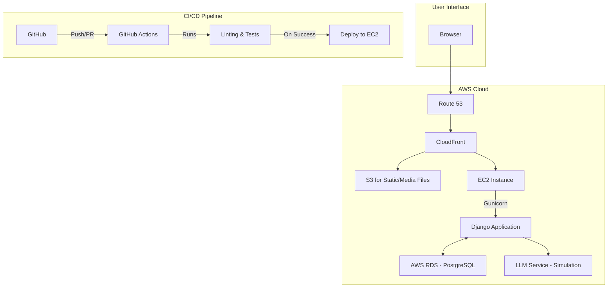
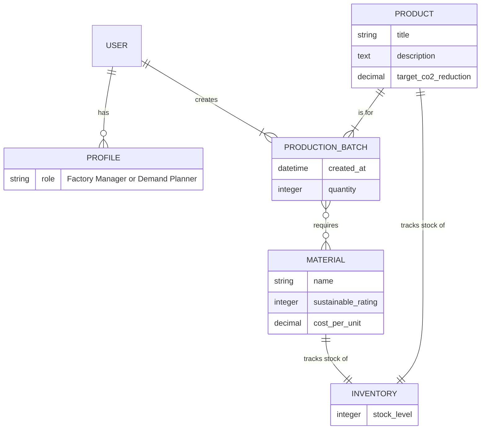

# A-FPMS: System Architecture and Design

This document outlines the architecture for the Sustainable Agile Factory Production Management System (A-FPMS).

## 1. System Overview

A-FPMS is a full-stack Django application designed to manage and optimize small-batch garment manufacturing. It will provide role-based access for different user types, a RESTful API for data management, and a simulated AI component for demand forecasting.

## 2. Technology Stack

*   **Backend:** Python, Django, Django REST Framework
*   **Database:** PostgreSQL (for production via AWS RDS), SQLite (for local development)
*   **Frontend:** Django Template Language (DTL), Tailwind CSS
*   **Testing:** `django.test.TestCase`, `rest_framework.test.APITestCase`
*   **CI/CD:** GitHub Actions
*   **Deployment:** Docker, AWS (EC2, RDS, S3, CloudFront), Gunicorn

## 3. High-Level Architecture Diagram



## 4. Django Project Structure

The project will be organized into a main project directory and three distinct apps, promoting modularity and separation of concerns.

```
afpms_project/
|-- afpms/                # Main project configuration
|   |-- __init__.py
|   |-- asgi.py
|   |-- settings.py
|   |-- urls.py
|   |-- wsgi.py
|-- core/                 # Core functionalities, user management
|   |-- models.py         # User Profile/Roles
|   |-- views.py
|   |-- urls.py
|-- inventory/            # Inventory and material management
|   |-- models.py         # Material, Inventory models
|   |-- admin.py
|   |-- signals.py
|-- production_planner/   # Production batch management
|   |-- models.py         # Product, ProductionBatch models
|   |-- serializers.py
|   |-- views.py
|   |-- urls.py
|-- manage.py
|-- requirements.txt
|-- Dockerfile
```

## 5. Database Schema



## 6. API Design

The primary API endpoint will revolve around the `ProductionBatch` resource, managed by a `ModelViewSet`.

*   **Endpoint:** `/api/v1/production-batches/`
*   **Methods:**
    *   `GET`: List all batches (Read-Only for Demand Planners).
    *   `POST`: Create a new batch (Factory Managers only).
    *   `PUT`/`PATCH`: Update a batch (Factory Managers only).
    *   `DELETE`: Delete a batch (Factory Managers only).
*   **Custom Action:**
    *   `POST /api/v1/production-batches/{pk}/start_production/`: A custom action to trigger the start of a production run.
*   **Authentication:** Token-based authentication will be required for all API endpoints.

## 7. Deployment Architecture

The application will be deployed to AWS using the following architecture:

*   **Compute:** The Django application will be run as a Docker container on an **AWS EC2** instance. **Gunicorn** will be used as the WSGI server.
*   **Database:** A managed **AWS RDS** instance running **PostgreSQL** will be used for the production database.
*   **Static & Media Files:** Static and media files will be served from an **AWS S3** bucket.
*   **CDN:** **AWS CloudFront** will be used as a Content Delivery Network (CDN) to cache static files and serve them from edge locations, reducing latency for users.
*   **DNS:** **AWS Route 53** will be used for DNS management.
*   **CI/CD:** The GitHub Actions workflow will be configured to automatically build the Docker image and deploy it to the EC2 instance on a successful merge to the `main` branch.
